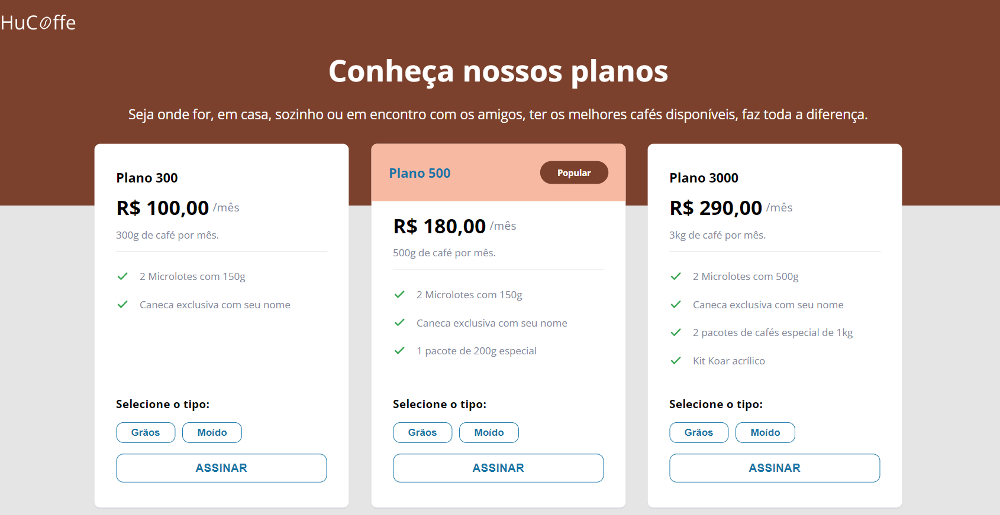

<h1 align="center">
   <p>HuCoffe</p>
</h1>

<p align="center">
 <a href="#tecnologias">Tecnologias</a> •
 <a href="#layout">Layout</a> • 
 <a href="#pre-requisitos">Pré-requisitos</a> • 
 <a href="#-guia-de-estilo">Guia de estilo</a> • 
 <a href="#tecnologias">Tecnologias</a> • 
 <a href="#-autora">Autora</a>
</p>

<h4 align="center"> 
	🎉 HuCoffe - Concluído  🎉
</h4>

## Sobre

Página web contendo uma tabela com as opções de preços/planos de uma loja de café, desenvolvido com <a href="https://pt-br.reactjs.org/" target="_blank">React.</a>
Este projeto foi proposto como desafio da modalidade Discover da <a href="https://www.rocketseat.com.br/" target="_blank">Rocketseat.</a>

## Carcterísticas

- Alteração do componente CardPlan dinamicamente
- Desenvolvimento com React.

## Tecnologias

As seguintes ferramentas foram usadas na construção do projeto:

- [React](https://pt-br.reactjs.org/)
- [HTML](https://www.w3schools.com/html/)
- [CSS](https://www.w3schools.com/css/)
- [Javascript](https://www.w3schools.com/js/js_intro.asp/)

## Layout

O layout da aplicação original está disponível no Figma:

<a href="https://www.figma.com/file/sSq019RDznSm3eyZoo3OHc/DD-Pricing-Table/duplicate">
  
</a>

<p style="display: flex;  justify-content: left; gap: 10px">
  
</p>

## Pre-requisitos

Antes de começar, você vai precisar ter instalado em sua máquina as seguintes ferramentas:
[Git](https://git-scm.com), [Node.js](https://nodejs.org/en/).
Além disto é bom ter um editor para trabalhar com o código como [VSCode](https://code.visualstudio.com/)

### 🎲 Rodando servidor

```bash
# Clone este repositório
$ git clone <https://github.com/TayAmorim/React-HuCoffe.git>

# Instale as dependências
$ npm install

# Execute a aplicação em modo de desenvolvimento
$ npm run dev

```

## 🎨 Guia de estilo

### Cores:

```css
:root {
  --emphasis-header: #7c412c;
  --emphasis-plan: #f8b9a2;
  --blue-hover: #1775a6;
  --text: #828799;
  --container: 6rem;
  --container-card: 30px;
}
```

### Tipo de Fonte:

- font-family: "Open Sans", sans-serif;

- Font-weight: 400, 600 e 700

<a href="https://www.figma.com/file/EYimYoWWhNVjDZdc0zv1Vw/DD-Portfolio-Copy?fuid=1100112420700070907">
  
</a>

## 🦸 Autora

<a href="https://www.linkedin.com/in/tayanna-amorim-98161623b/">
 
 <br />
 <sub><b>Tayanna Amorim</b></sub></a> <a href="https://www.linkedin.com/in/tayanna-amorim-98161623b/" title="tayanna"></a>
 <br />

<br />

[](https://www.linkedin.com/in/tayanna-amorim-98161623b/)
[](mailto:amorim.tayanna@gmail.com)
